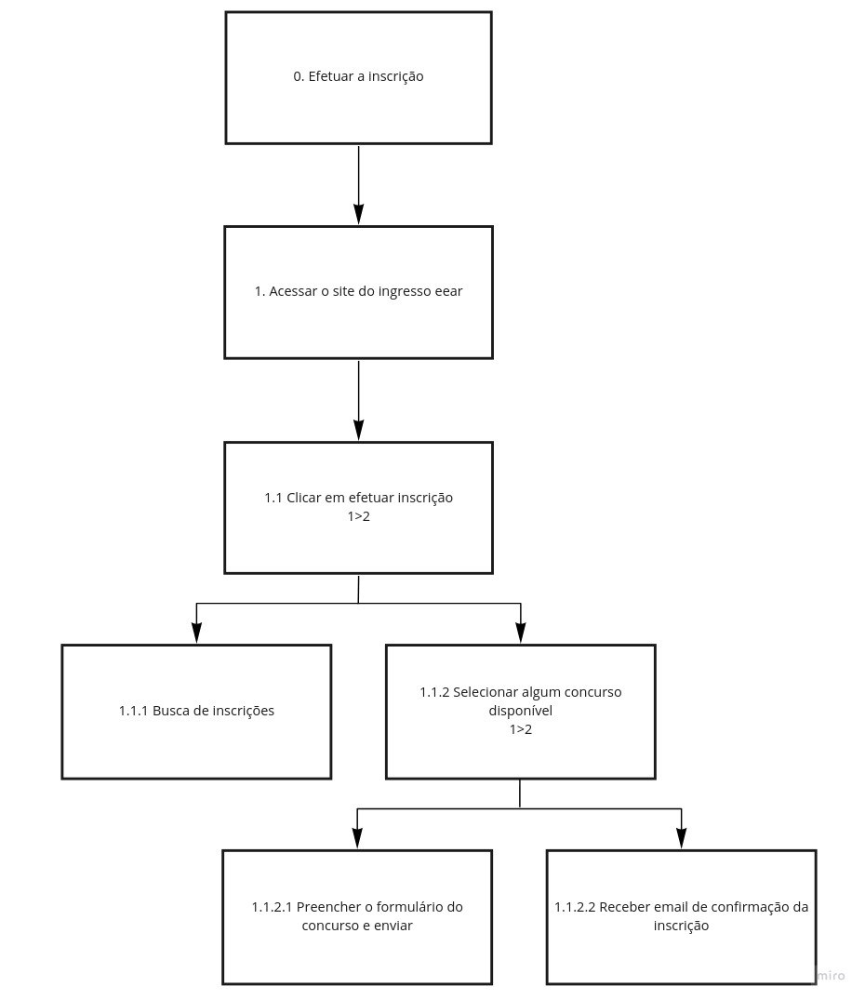
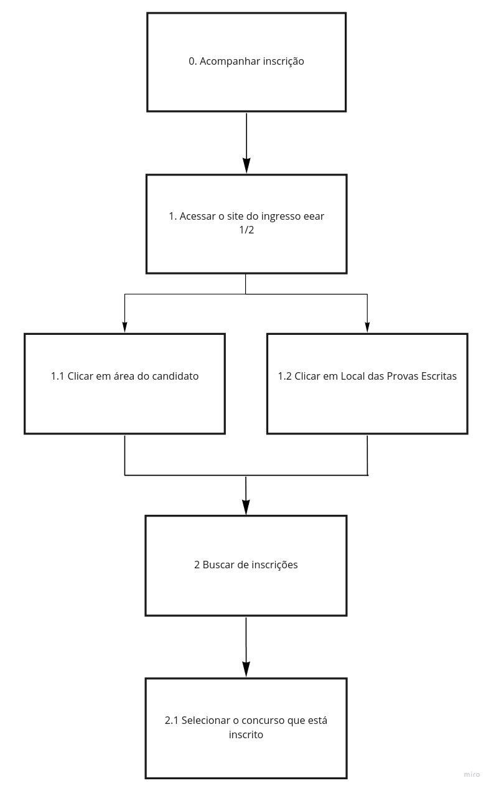

## Descrição e Objetivo

&emsp;&emsp; 
Uma análise de tarefas é utilizada para se ter um entendimento sobre qual é o <strong>trabalho dos usuários</strong>, como
eles o realizam e por quê. Nesse tipo de análise, o trabalho é definido em volta dos <strong>objetivos</strong> que os
usuários querem ou precisam atingir e, assim, elaborar uma lista das ações realizadas por um agente para alcançá-los.

&emsp;&emsp; 
A <strong>Análise Hierárquica de Tarefas</strong> é usada para entender as competências e habilidades exibidas em tarefas complexas e não repetitivas, bem como para auxiliar na identificação de problemas de desempenho. Ela ajuda a relacionar o que as pessoas fazem, por que o fazem, e quais as consequências caso não o façam corretamente. A HTA examina primeiramente os <strong>objetivos</strong> de alto nı́vel, decompondo-os em <strong>subobjetivos</strong>, buscando identificar quais subobjetivos são mais difı́ceis de atingir ou que geram mais erros e que, portanto, limitam ou mesmo <strong>impedem o atingimento do objetivo maior</strong>.

&emsp;&emsp; 
Como o intuito do site é ser uma plataforma para concurso da EEAR, identificamos <strong> 2 grandes objetivos</strong> no site escolhido para estudo. Esses objetivos são baseados fundamentalmente nas principais práticas que compõem a <strong>interação com os concursos</strong>. O primeiro grande objetivo é a <strong>inscrição no concurso</strong>, o início da jornada. O segundo grande objetivo é o <strong>acompanhamento das informações do concurso</strong>, como local, hora e resultados, assim englobando a parte restante da jornada.

## Efetuar a Inscrição em Concurso

Figura 1: Efetuar a Inscrição em Concurso

| **Objetivos / Operações** | **Problemas e Recomendações** |
| --- | --- |
| 0. Efetuar a Inscrição | <strong>Input: </strong>Formulário do concurso;   <strong>Feedback: </strong>Constar como inscrito na área do candidato;   <strong>Plano: </strong>Informar dados do candidato e enviar confirmação da inscrição. |
| 1. Acessar o Site | <strong>Plano:</strong> Acessar a área de efetuar a inscrição;   <strong>Problema: </strong>Site constantemente fica fora do ar. |
| 1.1. Clicar em Efetuar Inscrição |  <strong>Feedback: </strong> Redireciona para a página de busca de inscrições;   <strong>Problema: </strong> Não visualizar os concursos sem ter feito busca de inscrições;   <strong>Recomendação: </strong> Mostrar os concursos disponíveis sem ter feito busca de inscrições;   <strong>Plano: </strong>Ter acesso a página de busca de inscrições. |
| 1.1.1. Busca de Inscrições | <strong>Input:</strong> Preencher nome, senha e CPF;   <strong>Feedback:</strong> Redirecionar para a página do candidato;   <strong>Plano: </strong> Acesso aos concursos;   <strong>Problema: </strong> A página dá a entender que é um login, mas é uma busca de inscrições com os inputs informados;   <strong>Recomendação: </strong>Página deveria deixar mais explícito e intuitivo o caminho que será percorrido, o resultado da tarefa atual e das subsequentes. |
| 1.1.2. Clicar em Algum Concurso Disponível | <strong>Plano: </strong> Ter acessos ao formulário de inscrição;   <strong>Feedback:</strong> Redirecionar para o formulário do Concurso.   |
| 1.1.2.1. Preencher o Formulário do Concurso e Enviar | <strong>Input: </strong> Preencher campos do formulário;   <strong>Plano: </strong> Finalizar inscrição no concurso. |
| 1.1.2.2. Receber email de confirmação no concurso | <strong>Plano : </strong> Obter confirmação da inscrição do concurso;    <strong>Problema: </strong>Email não vem informações como local de prova e horário. |

## Acompanhar Inscrição em Concurso

Figura 2: Acompanhar Inscrição em Concurso

| **Objetivos / Operações** | **Problemas e Recomendações** |
| --- | --- |
| 0. Acompanhar Inscrição | <strong>Input: </strong> Acessar o concurso na área do candidato;   <strong>Feedback: </strong> Visualizar os dados do concurso na área do candidato;   <strong>Plano: </strong> Informar os dados do candidato inscrito  em um concurso e visualizar as informações sobre o mesmo. |
| 1. Acessar o Site | <strong>Plano: </strong> Visualizar a área do candidato;   <strong>Problema: </strong> Site constantemente fica fora do ar. |
| 1.1. Clicar em Área do Candidato | <strong>Feedback: </strong> Redireciona para a página da área do candidato;   <strong>Problema: </strong> Não visualizar os concursos sem ter feito busca de inscrições;   <strong>Recomendação: </strong> Mostrar os concursos disponíveis sem ter feito busca de inscrições;   <strong>Plano: </strong> Ter acesso a página de busca de inscrições. |
| 1.2. Clicar em Local das Provas Escritas | <strong>Feedback: </strong> Redireciona para a página da área do candidato;   <strong>Problema: </strong> Não visualizar os concursos sem ter feito busca de inscrições;   <strong>Recomendação: </strong> Mostrar os concursos disponíveis sem ter feito busca de inscrições;   <strong>Plano: </strong> Ter acesso a página de busca de inscrições. |
| 2. Busca de Inscrições | <strong>Input: </strong> Preencher nome, senha e CPF;   <strong>Feedback: </strong> Redirecionar para a página do candidato;   <strong>Plano: </strong> Acesso aos concursos;   <strong>Problema: </strong> A página insinua que é um login, mas na verdade busca inscrições com os inputs informados, sendo pouco intuitiva;   <strong>Recomendação: </strong> Deixar claro seu real funcionamento. |
| 2.1. Selecionar Concurso em que está Inscrito | <strong>Plano: </strong> Acessar as informações do concurso em que o candidato está inscrito. | 

## Bibliografia
> Barbosa, S. D. J.; Silva, B. S. da; Silveira, M. S.; Gasparini, I.; Darin, T.; Barbosa, G. D. J. (2021) <i>Interação Humano-Computador e Experiência do usuário</i>.

## Versionamento
| Versão | Data | Modificação | Autor |
|--|--|--|--|
| 1.0 | 17/03/2021 | Criação e desenvolvimento do documento | Bruno Félix e Daniel Barcelos |