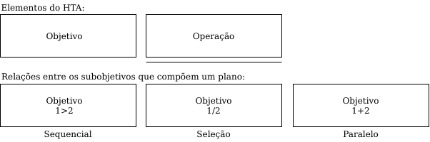
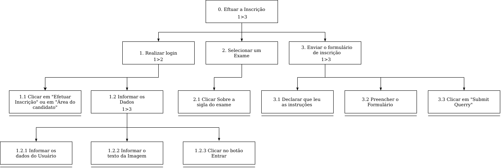

## Descrição e Objetivo

&emsp;&emsp; 
Uma análise de tarefas é utilizada para se ter um entendimento sobre qual é o <strong>trabalho dos usuários</strong>, como
eles o realizam e por quê. Nesse tipo de análise, o trabalho é definido em volta dos <strong>objetivos</strong> que os
usuários querem ou precisam atingir e, assim, elaborar uma lista das ações realizadas por um agente para alcançá-los.

&emsp;&emsp; 
A <strong>Análise Hierárquica de Tarefas</strong> é usada para entender as competências e habilidades exibidas em tarefas complexas e não repetitivas, bem como para auxiliar na identificação de problemas de desempenho. Ela ajuda a relacionar o que as pessoas fazem, por que o fazem, e quais as consequências caso não o façam corretamente. A HTA examina primeiramente os <strong>objetivos</strong> de alto nı́vel, decompondo-os em <strong>subobjetivos</strong>, buscando identificar quais subobjetivos são mais difı́ceis de atingir ou que geram mais erros e que, portanto, limitam ou mesmo <strong>impedem o atingimento do objetivo maior</strong>.

&emsp;&emsp; 
Como o intuito do site é ser uma plataforma para concurso da EEAR, identificamos <strong> 2 grandes objetivos</strong> no site escolhido para estudo. Esses objetivos são baseados fundamentalmente nas principais práticas que compõem a <strong>interação com os concursos</strong>. O primeiro grande objetivo é a <strong>inscrição no concurso</strong>, o início da jornada. O segundo grande objetivo é o <strong>acompanhamento das informações do concurso</strong>, como local, hora e resultados, assim englobando a parte restante da jornada.

## Diagramas HTA
&emsp;&emsp;A seguir estão os diagrmas HTA para as duas principais tarefas do escopo do projeto. Para desenvolver esses diagramas, a equipe utilizou a ferramenta Draw.io, onde o diagrama pode ser acessado por [aqui](https://drive.google.com/file/d/1C6jShXGzmvCVfr7s83fJBNn9U08kIvQx/view?usp=sharing).

### Legenda

Figura 1: Elementos de um diagrama HTA.

### Tarefa 1: Efetuar a Inscrição em Concurso

#### Diagrama

Figura 2: Efetuar a Inscrição em Concurso [Link para a imagem ampliada](https://user-images.githubusercontent.com/48573556/116830304-7bbb4980-ab7f-11eb-834c-4ac02bab3367.png)

#### Tabela de Especificações
| **Objetivos / Operações** | **Problemas e Recomendações** |
| --- | --- |
| 0. Efetuar a Inscrição 1>3|**Input:** Formulário de Inscrição em exame; **Feedback:** Consta como inscrito na área do candidato; **Plano:** Informar dados do candidato e enviar confirmação da inscrição.|
| 1. Realizar login 1>2|**Input:** Campos para dados do usuário e confirmação textual; **Feedback:** Redirecionamento para a área do condidato; **Plano:** Efetuar o login na plataforma.|
| 1.1. Clicar em "Efetuar Inscrição" ou em "Área do candidato"|**Problema:** Existem muitos fluxos redundantes; **Recomendação 1:** Simplificar os fluxos; **Recomendação 2:** Implementar persistência de dados.|
| 1.2. Informar os Dados 1>3|**Plano:** Informar e-mail, senha, cpf e confirma o texto;|
| 1.2.1. Informar os dados do Usuário||
| 1.2.2. Informar o texto da Imagem|**Problema:** O texto que precisa ser confirmado pode ser facilmente copiado; **Recomendação 1:** Implementar uma confirmação a partir de uma imagem real.|
| 1.2.3 Clicar no botão Entrar||
| 2. Selecionar um Exame|**Feedback:** Redirecionamento para a página do exame selecionado; **Plano:** Selecionar um exame para se inscrever; **Problema 1:** Não fica intuitivo como deve ser selecionado o exame; **Problema 2:** A disposição dos exames não é organizada; **Recomendação 1:** Separar os exames inscritos dos demais de forma que fique mais intuitivo e organizado.|
| 2.1 Clicar Sobre a sigla do exame||
| 3. Enviar o formulário de inscrição 1>3|**Feedback:** Redirecionamento para a página de acompanhamento; **Plano:** Preencher e enviar o formulário de inscrição.|
| 3.1. Declarar que leu as instruções|**Input:** Caixa de seleção para declarar que leu as informações.|
| 3.2 Preencher o Formulário||
| 3.3 Clicar em "Submit Querry"||

### Tarefa 2: Acompanhar Inscrição em Concurso

#### Diagrama

Figura 3: Acompanhar Inscrição em Concurso

#### Tabela de Especificações
| **Objetivos / Operações** | **Problemas e Recomendações** |
| --- | --- |
| 0. Acompanhar Inscrição | <strong>Input: </strong> Acessar o concurso na área do candidato;   <strong>Feedback: </strong> Visualizar os dados do concurso na área do candidato;   <strong>Plano: </strong> Informar os dados do candidato inscrito  em um concurso e visualizar as informações sobre o mesmo. |
| 1. Acessar o Site | <strong>Plano: </strong> Visualizar a área do candidato;   <strong>Problema: </strong> Site constantemente fica fora do ar. |
| 1.1. Clicar em Área do Candidato | <strong>Feedback: </strong> Redireciona para a página da área do candidato;   <strong>Problema: </strong> Não visualizar os concursos sem ter feito busca de inscrições;   <strong>Recomendação: </strong> Mostrar os concursos disponíveis sem ter feito busca de inscrições;   <strong>Plano: </strong> Ter acesso a página de busca de inscrições. |
| 1.2. Clicar em Local das Provas Escritas | <strong>Feedback: </strong> Redireciona para a página da área do candidato;   <strong>Problema: </strong> Não visualizar os concursos sem ter feito busca de inscrições;   <strong>Recomendação: </strong> Mostrar os concursos disponíveis sem ter feito busca de inscrições;   <strong>Plano: </strong> Ter acesso a página de busca de inscrições. |
| 2. Busca de Inscrições | <strong>Input: </strong> Preencher nome, senha e CPF;   <strong>Feedback: </strong> Redirecionar para a página do candidato;   <strong>Plano: </strong> Acesso aos concursos;   <strong>Problema: </strong> A página insinua que é um login, mas na verdade busca inscrições com os inputs informados, sendo pouco intuitiva;   <strong>Recomendação: </strong> Deixar claro seu real funcionamento. |
| 2.1. Selecionar Concurso em que está Inscrito | <strong>Plano: </strong> Acessar as informações do concurso em que o candidato está inscrito. | 

## Bibliografia
> Barbosa, S. D. J.; Silva, B. S. da; Silveira, M. S.; Gasparini, I.; Darin, T.; Barbosa, G. D. J. (2021) <i>Interação Humano-Computador e Experiência do usuário</i>.

## Versionamento
| Versão | Data | Modificação | Autor |
|--|--|--|--|
| 1.0 | 17/03/2021 | Criação e desenvolvimento do documento | Bruno Félix e Daniel Barcelos |