# Guia de estilo

## Introdução

### Objetivo do guia de estilo
&emsp;&emsp;O principal objetivo do guia de estilo é registrar as principais escolhas de design tomadas pelos desenvolvedores e documentar todas as características do site Ingresso EEAR. O guia de estilo é uma ferramenta de comunicação entre a equipe de design que irá desenvolver os primeiros protótipos e os desenvolvedores. 

### Organização e conteúdo do guia de estilo
&emsp;&emsp;Esse guia de estilo irá abordar os seguintes tópicos:

- Introdução  
- Resultados de Análise  
- Elementos de Interface  
- Elementos de Interação  
- Elementos de Ação  
- Vocabulário e Padrões  

### Público-alvo do guia de estilos
&emsp;&emsp;O público alvo deste guia são os próprios integrantes da equipe, que irão utilizar como material de apoio e estudo.

### Como utilizar o guia
&emsp;&emsp;O guia deve ser utilizado como base para as futuras decisões do projeto principalmente na elaboração de protótipos.

### Como manter o guia
&emsp;&emsp;O guia deve ser atualizado ao final de cada fase indicada pelo ciclo de Mayhew.

## Resultados de Análise

### Descrição do ambiente de trabalho do usuário
&emsp;&emsp;Ao acessar o site pela primeira vez o usuário se depara com um menu de busca por exames e/ou local de provas, um menu de navegação com as principais funções e um menu de notícias.

## Elementos de Interface

### Disposição espacial e grid
&emsp;&emsp;O site usa as tags de tabela do HTML para montar o grid. Além disso, o site não segue um padrão de páginas o que ocasiona a existência de mais de um tipo de grid utilizado no site para apresentar a disposição espacial dos elementos. Por isso tem-se que analisar e identificar os tipos de disposições usadas. 
&emsp;&emsp;Sendo assim, foram separados 5 tipos de grids principais no site:

#### Homepage:
&emsp;&emsp;A Homepage do site é bem simples. Utilizando tabelas HTML para dispor os elementos, possui um espaço para o título na parte superior com uma barra de pesquisa logo abaixo. Também é separada por uma linha vertical onde na direita se encontra um conjunto de botões quadrados em volta de outro quadrado central o qual contém alguns botões para se acessar as notícias. Na esquerda da linha divisória está um espaço direcionado para as notícias do dia. Segue abaixo o grid que foi citado anteriormente: 

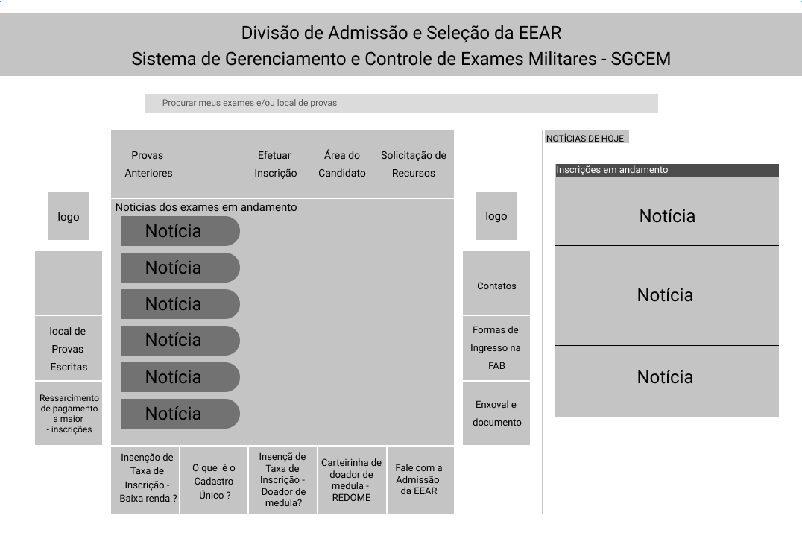

Figura 1: Grid da homepage. [link para a imagem expandida](https://user-images.githubusercontent.com/48573556/112408369-6c322080-8cf6-11eb-8b1c-6a45c5fea30c.png)

#### Login:
&emsp;&emsp;O site não possui persistência de dados de usuário. Por isso, sempre que o usuário precisar acessar alguma funcionalidade fora da área do participante, é preciso realizar o login. Isso causa algum transtorno por conta da repetição de atividades visto que é preciso preencher 4 campos para fazer o login. Segue abaixo o grid que foi citado anteriormente:

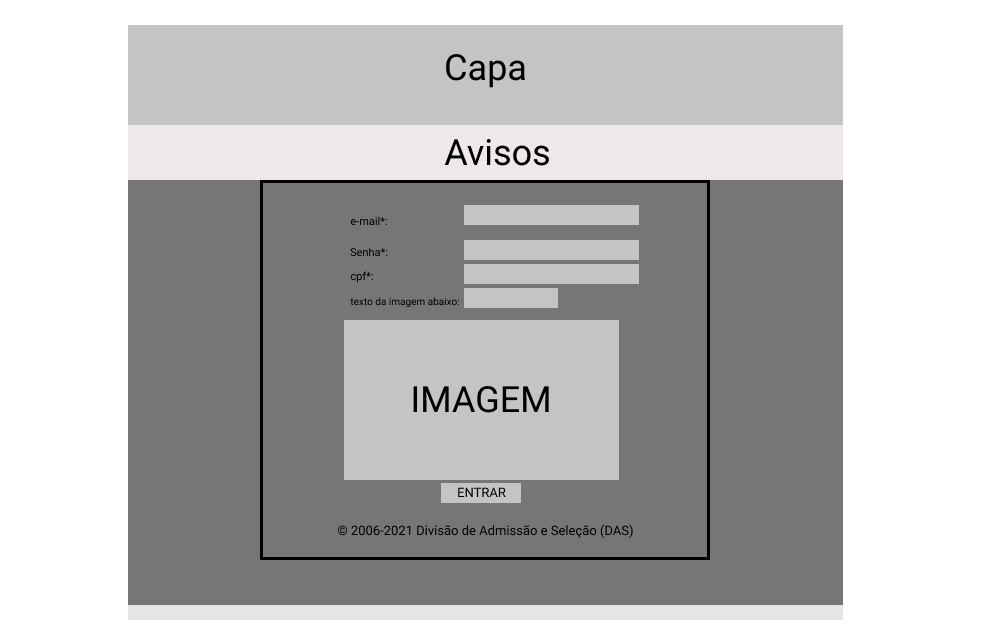

Figura 2: Grid da página de login. [Link para a imagem expandida](https://user-images.githubusercontent.com/48573556/112552402-7c530a00-8da1-11eb-9013-4f2e44e00662.png)

#### Área do Candidato:
&emsp;&emsp;A área do candidato é onde o usuário consegue acessar os concursos abertos e com inscrições disponíveis. Ele possui um layout bem simples com elementos quadrados e com algumas formas curvas. A disposição dos elementos não é muito intuitiva e passa uma ideia de desorganização para o usuário. Segue abaixo o grid que foi citado anteriormente:

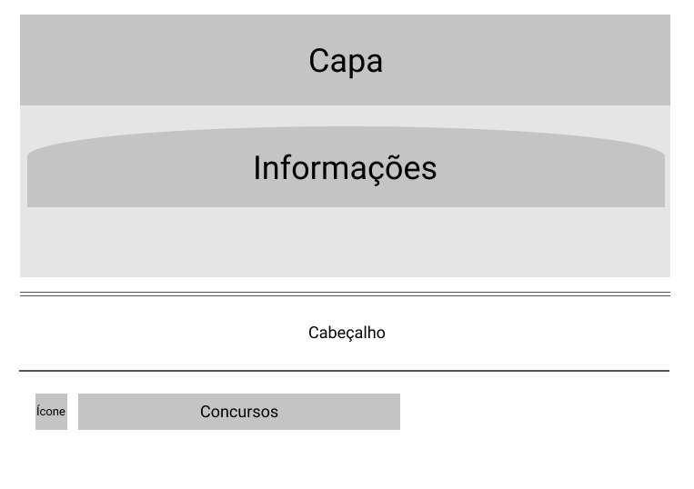

Figura 3: Grid da página da área do Candidato. [Link para a imagem expandida](https://user-images.githubusercontent.com/48573556/112552472-a6a4c780-8da1-11eb-9a9f-1ee568989c3a.png)

#### Provas Anteriores:
&emsp;&emsp;Nessa página o usuário pode obter os gabaritos de provas de concursos anteriores. A página é bem simples e direta, os dados de cada prova é separado por uma linha horizontal. No lado esquerdo de cada bloco está a identificação da prova e no direito se encontra um link direto para o gabarito. Segue abaixo o grid que foi citado anteriormente: 

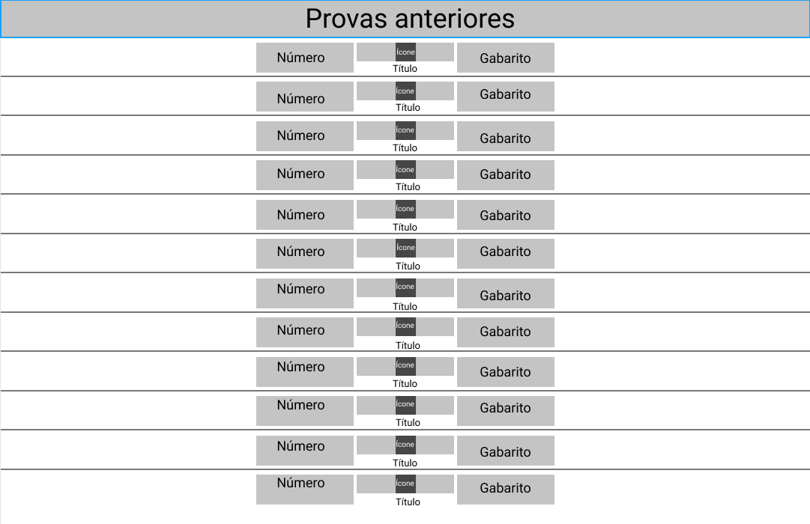

Figura 4: Grid da página de provas anteriores. [Link para a imagem expandida](https://user-images.githubusercontent.com/48573556/112552581-d522a280-8da1-11eb-821a-0d0f60faae6f.png)

#### Notícias:
&emsp;&emsp;A abordagem dessa página é muito simples e direta. As notícias publicadas são dispostas sequencialmente identificadas por seu título. Abaixo do título fica um link extenso que direciona o usuário para um arquivo onde estão as informações. Segue abaixo o grid que foi citado anteriormente:

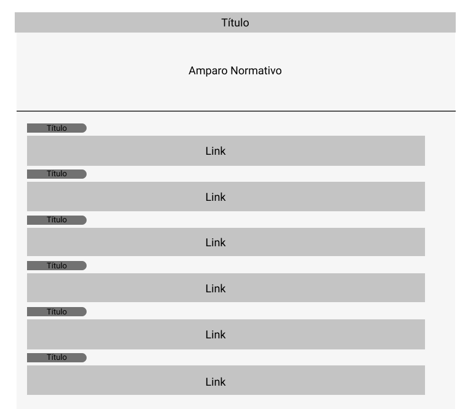

Figura 5: Grid da página de notícias. [Link para a imagem expandida](https://user-images.githubusercontent.com/48573556/112552641-e9ff3600-8da1-11eb-997e-7d4d6fbcd596.png)

### Janelas
&emsp;&emsp;O site da ingresso.EEAR possui algumas janelas. Dentre as janelas existentes, encontram-se a Homepage, a tela de login, a tela de notícia, questões anteriores e gabarito, entre outras. Colocamos abaixo alguns exemplos das janelas do site.

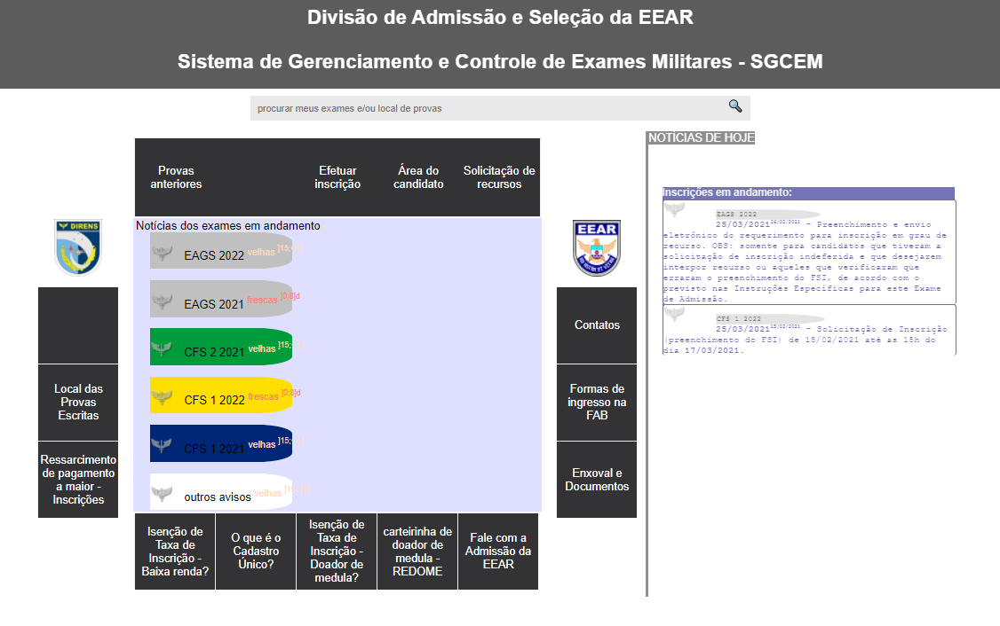

Figura 6 - Hompage [Link para a imagem expandida](https://user-images.githubusercontent.com/38890440/117554308-35f1fb80-b02d-11eb-8b3e-8b12062beec8.png)
  

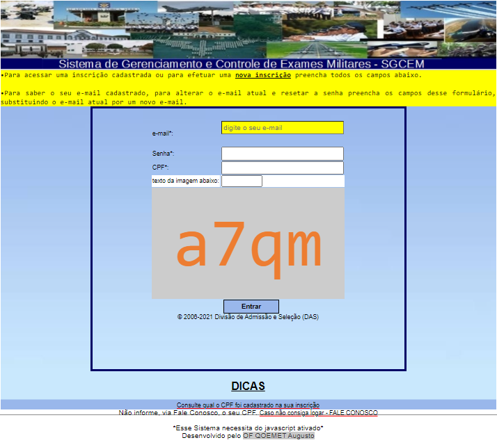

Figura 7 - Tela de login [Link para a imagem expandida](https://user-images.githubusercontent.com/38890440/117554360-89fce000-b02d-11eb-81a2-1ac60cef01e0.png)
  

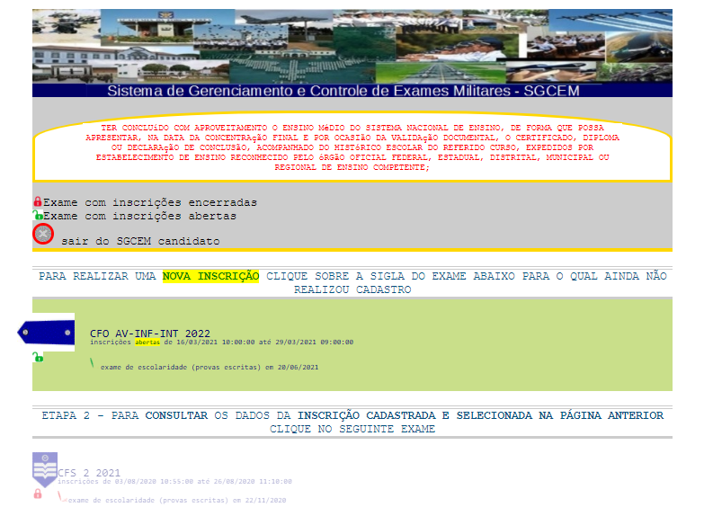

Figura 8 - Tela dentro do sistema [Link para a imagem expandida](https://user-images.githubusercontent.com/38890440/117554376-a13bcd80-b02d-11eb-976e-826b5aa8c0f0.png)
  

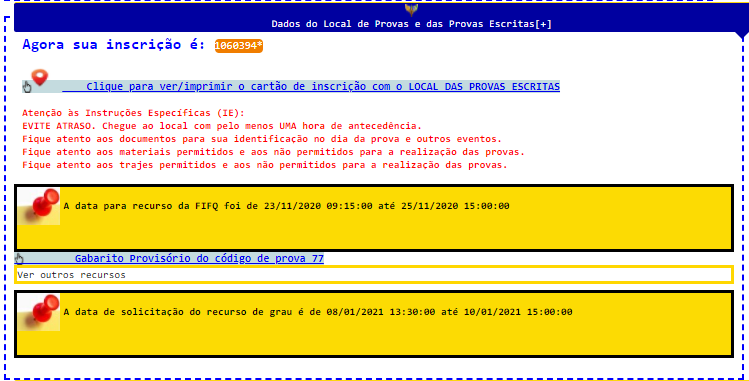

Figura 9 - Informação de inscricão [Link para a imagem expandida](https://user-images.githubusercontent.com/38890440/117554400-c03a5f80-b02d-11eb-8d13-685266495134.png)
  

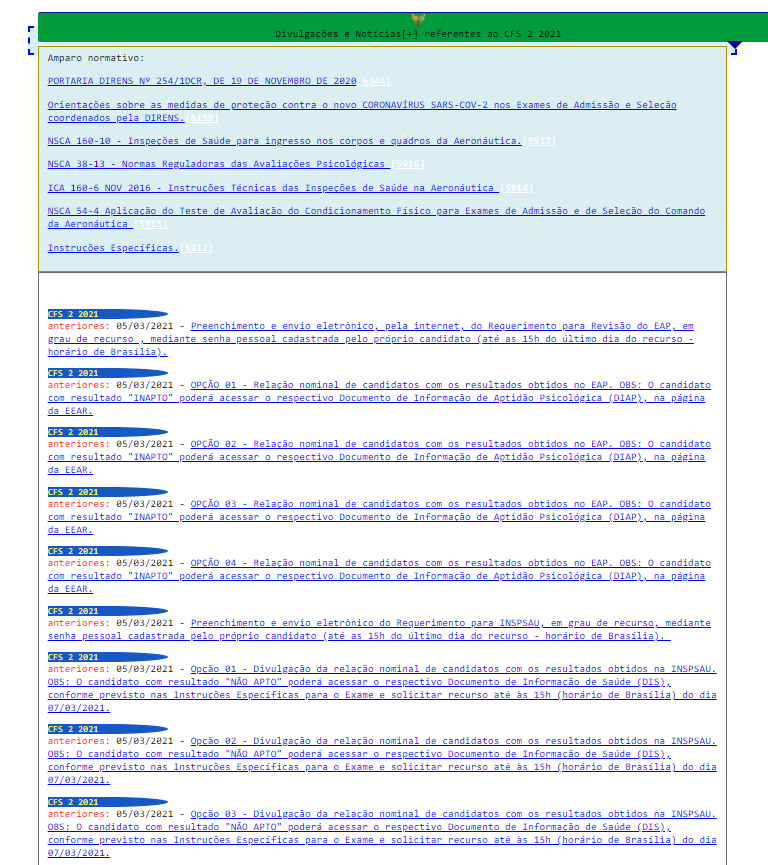

Figura 10 - Tela de informações [Link para a imagem expandida](https://user-images.githubusercontent.com/38890440/117554408-d6482000-b02d-11eb-8372-730ba5eef960.png)
  

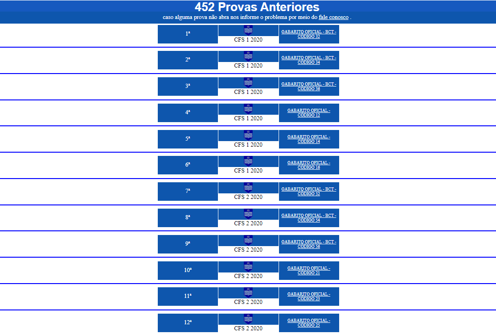

Figura 11 - Provas e gabaritos [Link para a imagem expandida](https://user-images.githubusercontent.com/38890440/117554468-566e8580-b02e-11eb-8756-1b41ba6e6c7d.png)
  

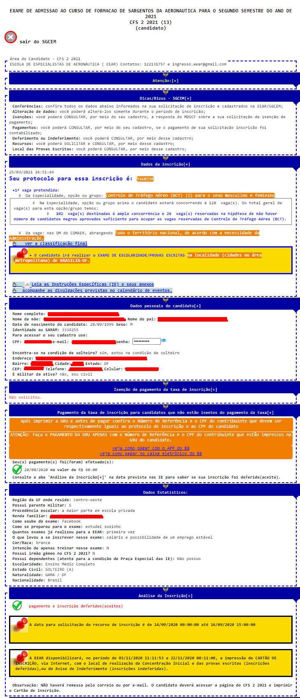

Figura 12 - Informações candidato [Link para a imagem expandida](https://user-images.githubusercontent.com/38890440/117554482-6e460980-b02e-11eb-8833-0be71b7cd7a1.png)
  

### Tipografia
&emsp;&emsp;A tipografia do site utiliza as seguintes fontes: 

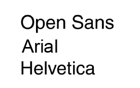

Figura 13 - Tipografia
  

### Símbolos não tipográficos
&emsp;&emsp;A plataforma não utiliza muitos elementos não tipográficos que não sejam emblemas e símbolos militares. Segue abaixo alguns dos elementos não tipográficos presentes na página:

- Lupa da barra de pesquisa 🔍
- Símbolo de delete 

- Gladio Alado 

- Distintivo de terceiro sargento 

### Cores
Aqui está a paleta de cores utilizada nas logos do site:

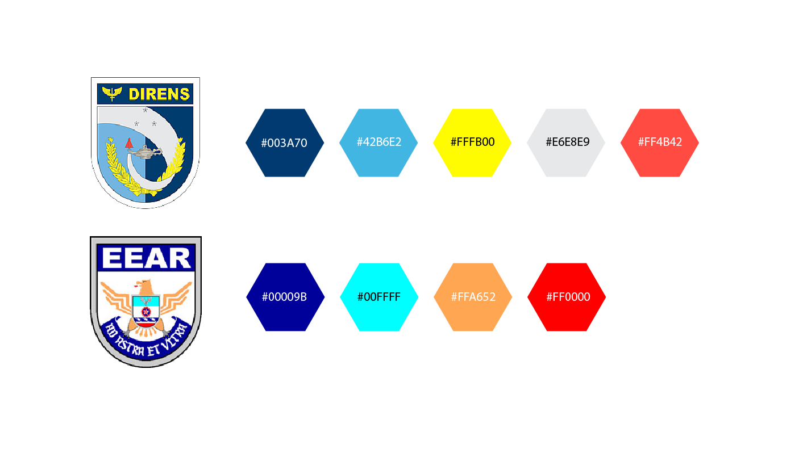

Figura 14 - Paleta de cores logo
  

Estas foram as cores predominantes no site:

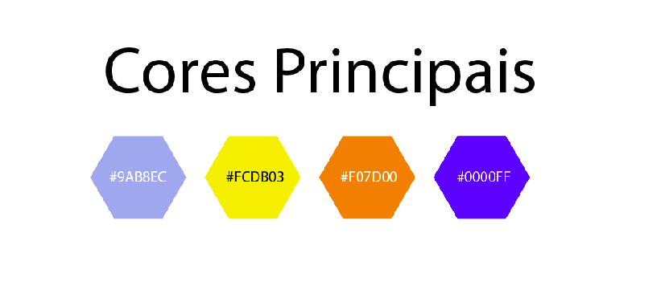

Figura 15 - Paleta de cores site
  

### Animações
&emsp;&emsp;O site possui poucas animações. Nas páginas referentes a área do participante, ao passar o mouse na imagem da lapela, a área do concurso escurece e surge um texto em vermelho na área em arco no superior da página. 
&emsp;&emsp;Outra animação disponível no site fica na página de notícias, onde é possível esconder o conteúdo da página clicando no ícone do gládio alado.

## Elementos de Interação

### Estilos de interação
&emsp;&emsp;As interações no site ocorrem através dos menus que se utilizam de linguagem natural, preenchimento de formulários para efetuar inscrições, WIMP(windows, icons, menus, pointer) que consiste em um ícone clicável que redireciona o usuário.

### Seleção de um estilo
&emsp;&emsp;O estilo do site é baseado em menus em que o usuário seleciona a função desejada e é redirecionado para o local onde será feita a mesma.

### Aceleradores  (Teclas de atalho)
&emsp;&emsp;Não foram encontrados acelerados no site.

## Elementos de ação

### Preenchimento de campos
&emsp;&emsp;O usuário deve preencher campos quando for realizar login e realizar a inscrição em algum exame.

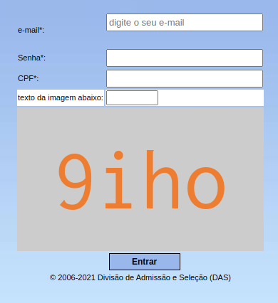

Figura 16: Formulário para realizar o login.

### Seleção
&emsp;&emsp;Não foi encontrado opção de seleção no site.

### Ativação
&emsp;&emsp;Após o preenchimento dos campos o usuário deve clicar no botão de "Entrar".

## Vocabulário e Padrões

### Terminologia
&emsp;&emsp;A linguagem utilizada no site é simples e de fácil entendimento, contudo são utilizadas várias abreviações de termos relacionados à aeronáutica que podem dificultar o entendimento do usuário.

### Tipos de tela
&emsp;&emsp;O site não possui um padrão de telas, apenas menus que redirecionam o usuário para funções dentro do próprio site ou sites externos.

### Sequências de diálogos
&emsp;&emsp;Preencher após o site voltar a funcionar.

## Bibliografia
> - BARBOSA, Simone. SILVA Bruno. "Interação Humano-Computador".
> - Site do [ingresso eear](https://ingresso.eear.aer.mil.br/).

## Versionamento
| Versão | Data | Modificação | Autor |
|:-:|--|--|--|
| 0.1 | 23/03/2021 | Criação do Guia de Estilo | Daniel B. e Yan |
| 1.0 | 24/03/2021 | Adição do grid da Homepage | Daniel P. e Denys |
| 1.1 | 25/03/2021 | Adição da imagem de realizar login | Yan |
| 1.2 | 25/03/2021 | Adição das imagens da janela | Denys |
| 1.3 | 25/03/2021 | Conclusão do tópico disposição espacial e grid | Daniel P. |
| 1.4 | 25/03/2021 | Adição dos tópicos símbolos não tipográficos e animaçẽos | Daniel P. |
| 1.5 | 08/05/2021 | Corrigindo documento pela verificação | Bruno Félix |
| 1.6 | 08/05/2021 | Inserindo imagens de expansão | Bruno Félix |