## Introdução
&emsp;&emsp;Esse documento tem como objetivo levantar e explorar as características dos usuários da plataforma Ingresso.EEAR. Para isso, é preciso traçar o perfil dos usuários para responder algumas perguntas como: "Quem são?", "Quais os objetivos" entre outras. Isso ajudará a equipe a entender a quem deve direcionar o projeto. 

## Metodologia
&emsp;&emsp;Ao iniciar um projeto, os designers começam os trabalhos com uma ideia inicial de quem são seus usuários. Porém, essa ideia pode não ser suficientemente detalhada, bem como pode se tratar apenas de uma impressão equivocada. Sendo assim, alguns dados devem ser levantados através de alguma técnica para o melhor detalhamento dos perfis de usuários. 
&emsp;&emsp;No contexto do projeto, os integrantes da equipe têm uma noção de que a plataforma Ingresso.EEAR é majoritáriamente utilizada e acessada por militares e estudantes na faixa etária entre 15 e 25 anos. 
&emsp;&emsp;Sendo assim, para o maior detalhamento e melhor definição, foi aplicada a técnica de questionário para levantar alguns dados do público alvo. Foi elaborado um questionário com 13 questões, sendo algumas específicas sobre o usuário, como faixa etária e escolaridade, e outras sobre as opiniões e contato com a plataforma.

## Resultados
### Questão 1
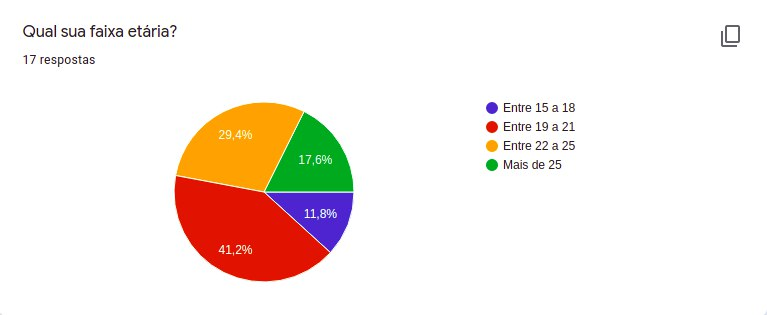

Figura 1: Composição dos pesquisados por faixa etária. 

### Questão 2
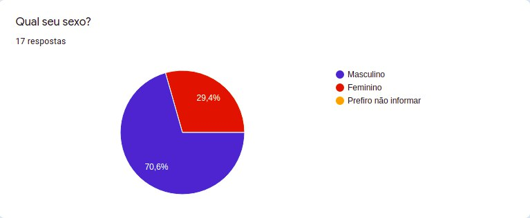

Figura 2: Composição dos pesquisados por sexo.

### Questão 3
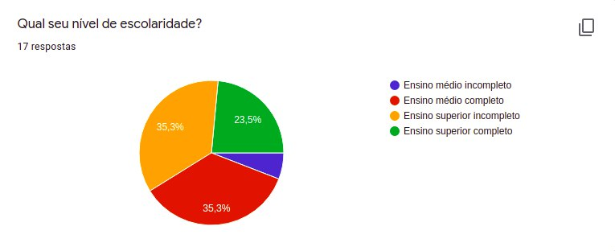

Figura 3: Nível de escolaridade dos pesquisados.

### Questão 4
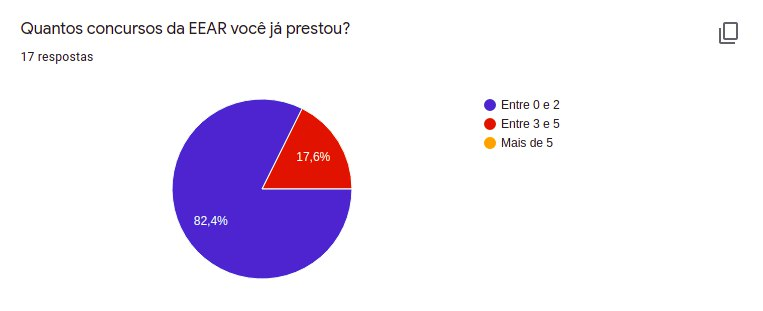

Figura 4: Quantidade de concursos prestados pelos pesquisados.

### Questão 5
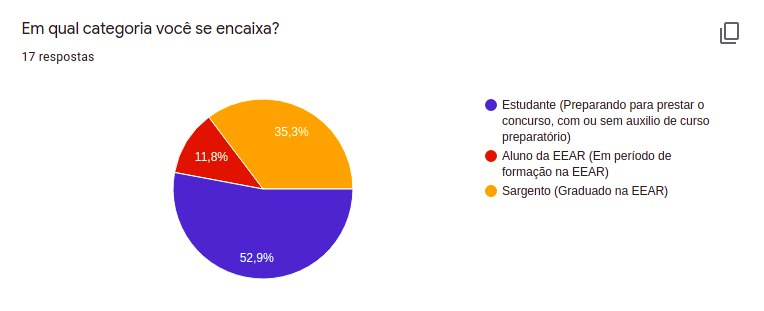

Figura 5: Categoria dos pesquisados.

### Questão 6
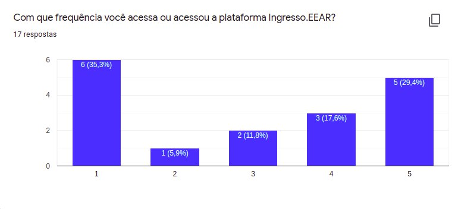

Figura 6: Frequência de acesso à plataforma em escala linear. <b>1 = Pouca e 5 = Muita.</b>

### Questão 7
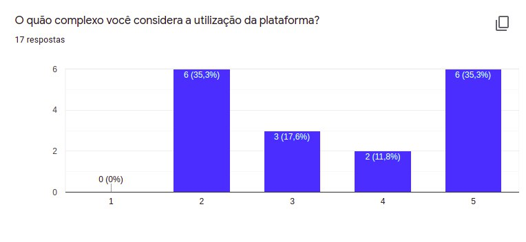

Figura 7: Opinião dos pesquisados sobre a complexidade de utilização do sistema em escala linear. <b>1 = Pouco e 5 = Muito.</b>

### Questão 8
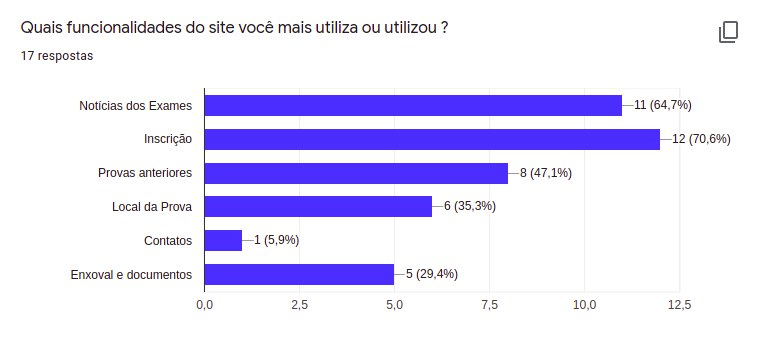

Figura 8: Funcionalidades da plataforma mais utilizadas pelos pesquisados.

### Questão 9
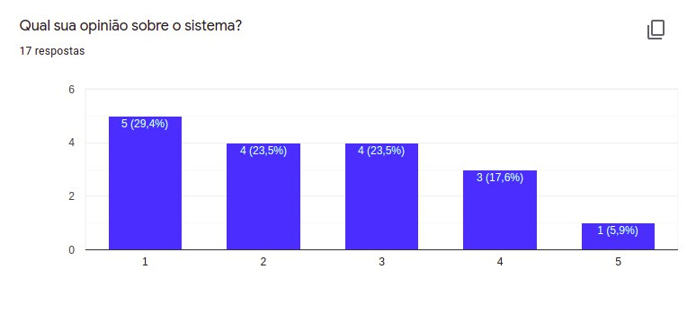

Figura 9: Opinião dos pesquisados sobre o sistema em escala linear. <b>1 = Ama e 5 = Odeia.</b>

### Questão 10
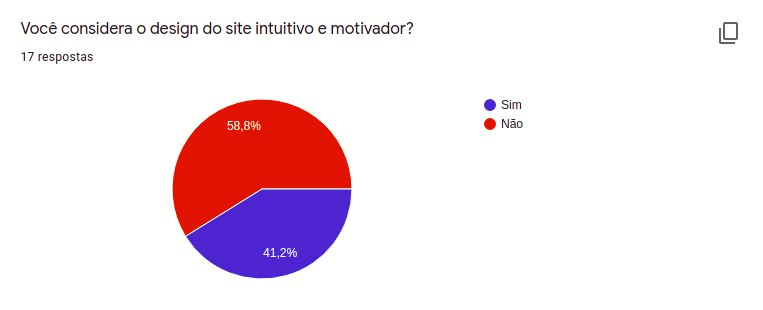

Figura 10: Opinião dos pesquisados sobre a intuitividade do sistema.

### Questão 11
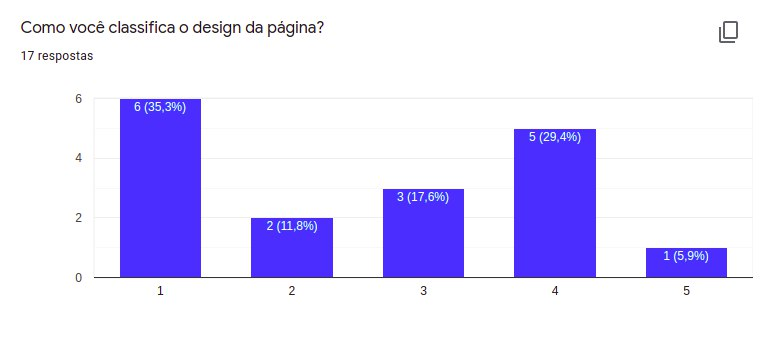

Figura 11: Opinião dos pesquisados sobre o design da página em escala linear. <b>1 = Desagradável e 5 = Agradável.</b>

### Questão 12
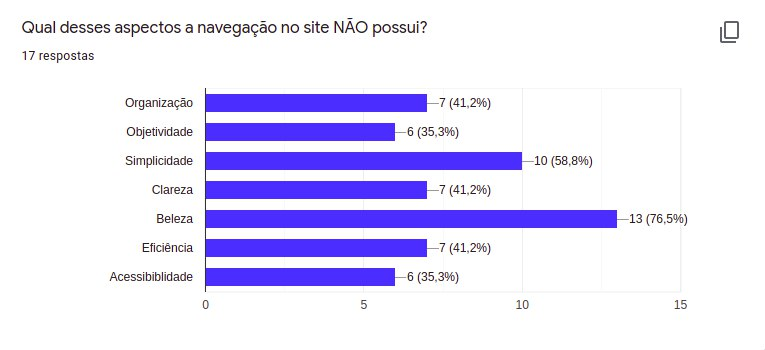

Figura 12: Opinião dos pesquisados sobre os aspectos que faltam na plataforma.

### Questão 13
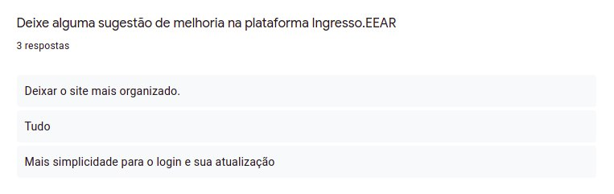

Figura 13: Sugestões dos pesquisados de melhorias na plataforma.

## Perfil do Usuário

&emsp;&emsp;Analisando os dados levantados conclui-se que o perfil do usuário que mais utiliza a plataforma Ingresso.EEAR consiste de estudantes em preparação para adentrar aos quadros da EEAR. Sendo assim, a equipe direcionará o projeto para esse perfil de usuário. Os dados completos da pesquisa podem ser acessados [aqui](https://docs.google.com/spreadsheets/d/14r3B4UtWBtL6no1Bf6wTW2tgOGYAbcb3kUT9oJepQw0/edit?usp=sharing).

| Perfil | Estudante |
|--|:-:|
| Percentual do perfil entre os pesquisados | **52,9%** |
| Quantidade de estudantes entre os pesquisados | **9** |
| Faixa Etária | **15 a 25** |
| Percentual de estudantes do sexo masculino | **66,6%** |
| Percentual de estudantes do sexo feminino | **33,3%** |
| Percentual de estudante por número de concursos prestados | - 0 a 2: **66,6**    - 3 a 5: **33,3%** |
| Nível de escolaridade  (EM. = ensino médio, ES. = esino superior) | - EM. incompleto: **11,1%**   - EM. Completo: **44,4%**  - ES. incompleto: **33,3%**   - ES. completo: **11,1%** |
| Média de frequência de acesso à plataforma  (1 = Pouca e 5 = Muita) | **3.9** |
| Percentual de estudantes que nãos acham a plataforma intuitiva | **66,6%** |
| Média da complexidade de utilização da plataforma  (1 = Pouco e 5 = Muito) | **3.8** |
| Funcionalidades mais utilizadas | - Notícias dos Exames: **66,6%**  - Inscrição: **77,7%**  - Provas anteriores: **33,3%**  - Local da Prova: **22,2%**  - Contatos: **11,1%**  - Enxoval e documentos: **11,1%** |

## Bibliografia
> - BARBOSA, Simone. SILVA Bruno. "Interação Humano-Computador".

## Versionamento
| Versão | Data | Modificação | Autor |
|:-:|--|--|--|
| 0.1 | 15/03/2021 | Criação e compartilhamento do questionário | Daniel P. e Denys |
| 1.0 | 16/03/2021 | Adição da introdução e e metodologia  | Daniel P. e Denys |
| 2.0 | 17/03/2021 | Adição dos resultados, análise dos dados e perfil do usuário | Daniel P. e Denys |
| 2.1 | 08/05/2021 | Corrigindo documento pela verificação |Bruno Félix|
