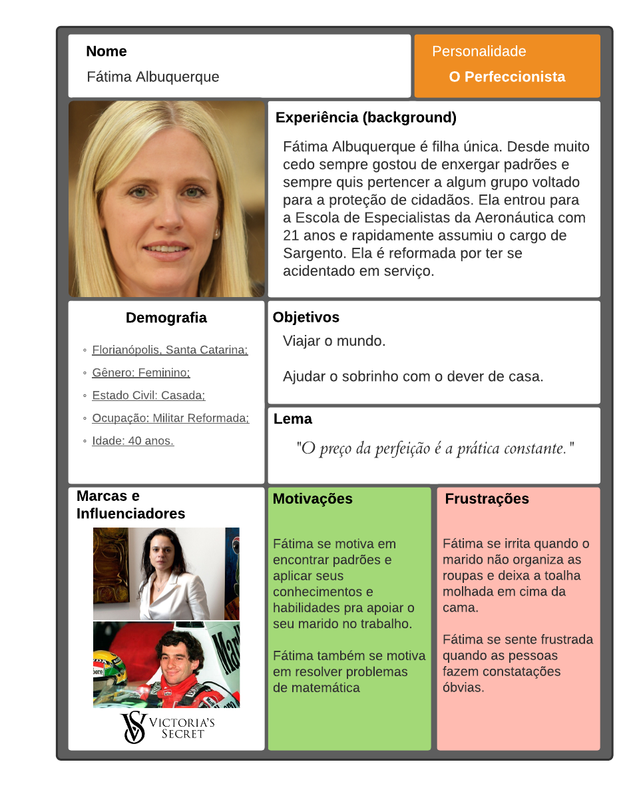

## Introdução 

## Personas Primárias

### Persona 1
[Link para a imagem expandida](https://user-images.githubusercontent.com/48573556/111569630-ca548600-8781-11eb-9085-8e7a6fc96364.png)

Figura 1: Persona primária 1: Cristina Guerra.

## Persona 2
[Link para a imagem expandida](https://user-images.githubusercontent.com/48573556/111570269-32579c00-8783-11eb-9f0b-8868c772939f.png)

Figura 2: Persona primária 2: Alberto da Silva.

## Antipersona
[Link para a imagem expandida](https://user-images.githubusercontent.com/48573556/111570369-78146480-8783-11eb-8d08-bfefc18fc0ad.png)

Figura 3: Antipersona: Fátima Albuquerque.

## Bibliografia
> - BARBOSA, Simone. SILVA Bruno. "Interação Humano-Computador".

## Versionamento
| Versão | Data | Modificação | Autor |
|:-:|--|--|--|
|0.1|17/03/2021| Criação das personas | Daniel P. e Yan |
|1.0|18/03/2021| Adição das personas e antipersona | Daniel P. e Yan |
