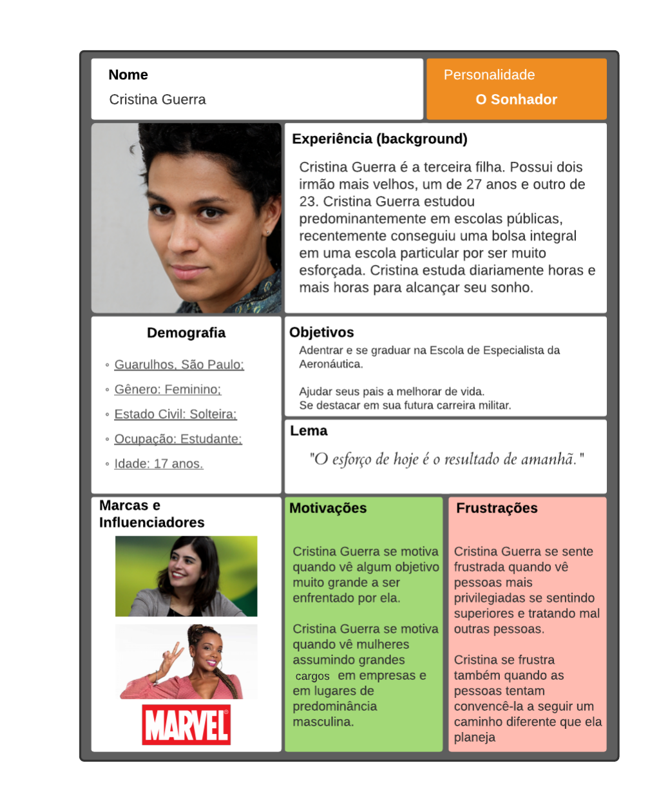
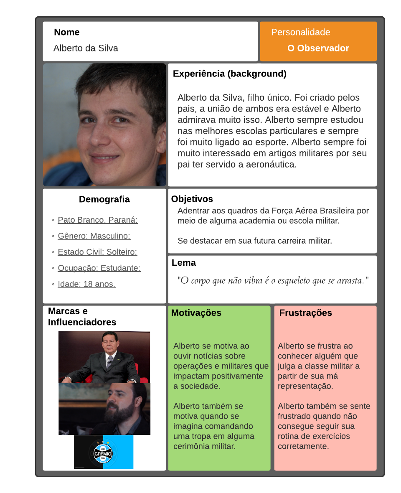

## Introdução 

&emsp;&emsp;Este documento visa apresentar um  grupo de personas, persona é um personagem fictício, arquétipo hipotético de um grupo de usuários reais, criado para descrever um usuário típico (Cooper et al., 2007; Pruitt e Adlin, 2006). É utilizada principalmente para representar um grupo de usuários finais durante discussões de design, mantendo todos focados no mesmo alvo. As personas são definidas principalmente por seus objetivos, que são determinados num processo de refinamentos sucessivos durante a investigação inicial do domínio de atividade do usuário. 

&emsp;&emsp;Para criar as personas foi necessário uma releitura do documento de perfil do usuário. Assim possibilitando a identificação de grupos característicos de usuários dos sistemas de ingresso na EEAR. Após a identificação desses grupos e de suas características predominantes, foi utilizado o site [uxpressia](https://uxpressia.com/) para inspiração ao criar os cartões de cada persona. 

&emsp;&emsp;Os tipos de personalidade foram baseados no site [vittude](https://www.vittude.com/blog/eneagrama/) utilizando a técnica de eneagrama.

&emsp;&emsp;Vale ressaltar que as imagens das pessoas utilizadas nos cartões das personas são pessoas fictícias, criadas a partir da inteligência artificial no site [ThisPersonDoesNotExist](https://thispersondoesnotexist.com/). Dessa forma, não infringindo nenhuma lei de direitos autorais.

## Personas Primárias

## Persona 1
[Link para a imagem expandida](https://user-images.githubusercontent.com/48693812/111655003-091d2700-87e8-11eb-8d3f-0daa2c4b23c0.png)

Figura 1: Persona primária 1: Cristina Guerra.

## Persona 2
[Link para a imagem expandida](https://user-images.githubusercontent.com/48693812/111655762-abd5a580-87e8-11eb-90d4-c5a2403792e9.png)

Figura 2: Persona primária 2: Alberto da Silva.

## Antipersona
[Link para a imagem expandida](https://user-images.githubusercontent.com/48693812/111655483-7630bc80-87e8-11eb-8bbc-e3268b4b0bed.png)

Figura 3: Antipersona: Fátima Albuquerque.

## Bibliografia
> - Cooper, A.; Reimann, R.; Cronin, D. About Face 3: Th e Essentials of Interaction Design. New York, NY: John Wiley & Sons, 2007.
> - Pruitt, J. & Adlin, T. Th e Persona Lifecycle: keeping people in mind throughout product design. San Francisco, CA: Morgan Kaufmann Publishers, 2006.

## Versionamento
| Versão | Data | Modificação | Autor |
|:-:|--|--|--|
|0.1|17/03/2021| Criação das personas | Daniel P. e Yan |
|1.0|18/03/2021| Adição das personas e antipersona | Daniel P. e Yan |
|2.0|18/03/2021| Adição da introdução e alteração do quadro das personas e antipersona | Yan |
|2.0.1|18/03/2021| Alteração da referência bibliográfica | Yan |