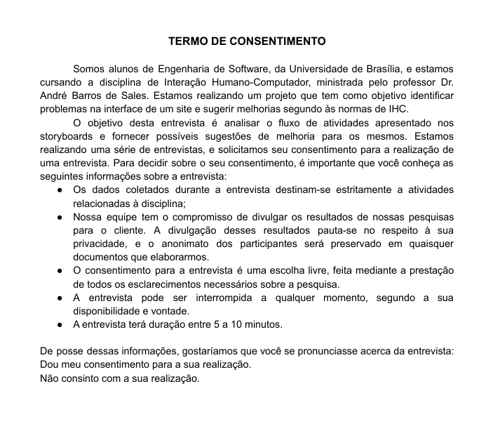

## Introdução
&emsp;&emsp;"A avaliação de IHC é uma atividade fundamental em qualquer processo de desenvolvimento que busque produzir um sistema interativo com alta qualidade de uso. Ela orienta o avaliador a fazer um julgamento de valor sobre a qualidade de uso da solução de IHC e a identificar problemas na interação e na interface que prejudiquem a experiência particular do usuário durante o uso do sistema. Assim, é possível corrigir os problemas relacionados com a qualidade de uso antes de inserir o sistema interativo no cotidiano dos usuários, seja um sistema novo ou uma nova versão de algum sistema existente" (Barbosa e Silva, 2019, p. 286). 

## Metodologia
&emsp;&emsp;Para verificar o Storyboard levantamos um roteiro de perguntas anteriormente no planejamento. Então, decidimos utilizar como técnica, previamente o teste-piloto para detectar erros e posteriormente utilizamos o método da entrevista. 

### Termo de consentimento

Figura 1: Termo de consentimento

Fonte: Autor

## Objetivo da avaliação
&emsp;&emsp;O Relato dos resultados tem como objetivo saber se o storyboard elaborado pela equipe está de acordo com o que se espera com qualidade e clareza. 

## Relato da Avaliação
### Teste-Piloto

| Número | 
Pergunta | 
Opções de resposta |
|:---:|:----------|:-------------------|
| 1 | A situação representada pelo primeiro storyboard condiz com a realidade? | [X] Sim [ ] Não |
| 2 | Qual sugestão de alteração ou melhoria para o storyboard sugere? | Nenhuma melhoria nem alteração foi sugerida. |
| 3 | A situação representada pelo segundo storyboard condiz com a realidade? | [X] Sim [ ] Não |
| 4 | Qual sugestão de alteração ou melhoria para o storyboard sugere? | Nenhuma melhoria nem alteração foi sugerida. |
| 5 | A situação representada pelo terceiro storyboard condiz com a realidade? | [X] Sim [ ] Não |
| 6 | Qual sugestão de alteração ou melhoria para o storyboard sugere? | Nenhuma melhoria nem alteração foi sugerida. |

### Entrevista Convencional

| Número | 
Pergunta | 
Opções de resposta |
|:---:|:----------|:-------------------|
| 1 | A situação representada pelo primeiro storyboard condiz com a realidade? | [ ] Sim  [X] Não |
| 2 | Qual sugestão de alteração ou melhoria para o storyboard sugere? | Inserir algum parente ou amigo no storyboard relatando sobre as provas disponíveis. |
| 3 | A situação representada pelo segundo storyboard condiz com a realidade? | [X] Sim [ ] Não |
| 4 | Qual sugestão de alteração ou melhoria para o storyboard sugere? | Nenhuma melhoria nem alteração foi sugerida. |
| 5 | A situação representada pelo terceiro storyboard condiz com a realidade? | [X] Sim [ ] Não |
| 6 | Qual sugestão de alteração ou melhoria para o storyboard sugere? | Nenhuma melhoria nem alteração foi sugerida. |

## Referência
> Barbosa, S. D. J.; Silva, B. S. da; Silveira, M. S.; Gasparini, I.; Darin, T.; Barbosa, G. D. J. (2021) *Interação Humano-Computador e Experiência do usuário.*

## Versionamento

|Versão|Data|Modificação|Autor|
|:-:|--|--|--|
|1.0|22/04/2021|Abertura do documento| Daniel Barcelos |
|1.1|23/04/2021|Relato dos resultados do Storyboard| Yan Andrade |