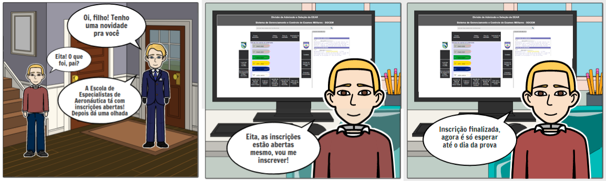
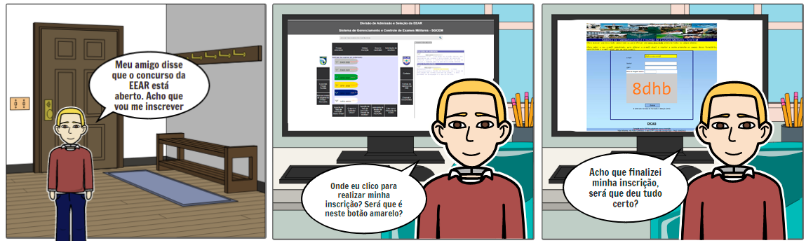

# Storyboard
## 1. Introdução
&emsp;&emsp;Storyboard é um tipo de protótipação de baixa fidelidade, que consiste em uma série de desenhos mostrando como um usuário pode progredir em uma tarefa utilizando o produto que está sendo estudado. Pode-se tratar de uma série de telas esboçadas, ou de uma série de cenas desenhadas mostrando como um usuário pode desempenhar determinada tarefa utilizando um produto. (ROGERS, et al.)

## 2. Objetivo
&emsp;&emsp;O objetivo da criação dos Storyboards é validar o nível 1 da fase de Design, avaliação e desenvolvimento da Engenharia de usabilidade Mayhew, que consiste em criar protótipos do modelo conceitual.

## 3. Metodologia
&emsp;&emsp;Para desenvolver os stroyboards, foi necessário uma releitura do documento de Análise de Tarefas. A plataforma utilizada para elaborar o storyboard foi o Canva(link).

## 4. Resultados
&emsp;&emsp;A seguir encontram-se os storyboards desenvolvidos, criados a partir das análises das tarefas:
## Storyboard 1: Realizar a inscrição
### Preparo
<b>Definição das pessoas envolvidas</b> 
Persona: Alberto da Silva 
<b>Definição do ambiente da história</b> 
Quarto de Alberto 
<b>Definição da tarefa a ser abordada</b> 
Realizar a inscrição no concurso da EEAR 

### Sequência
<b>Definição de quais passos estão envolvidos para realização da tarefa</b>
1. Pensar em se inscrever no concurso da EEAR 
2. Acessar a página da EEAR e descobrir que as inscrições estão abertas 
3. Relizar a inscrição 

<b>Definição do que leva a pessoa a usar a aplicação</b> 
Descobrir se há algum concurso aberto da EEAR e realizar a inscrição 
<b>Definição da tarefa a será ilustrada</b> 
Se inscrever no concurso da EEAR que será representado pelo personagem acessando a plataforma e realizando a inscrição com sucesso 

### Satisfação
<b>Motivação principal da pessoa que usa a aplicação</b> 
Encontrar informações sobre o concurso da EEAR 
<b>Definição das realizações que a aplicação permite</b> 
Realizar inscrição para o concurso escolhido 
<b>Definição das necessidades que a aplicação se propõe a sanar</b> 
Permitir a realização da inscrição para concursos da EEAR 

## Storyboard 2: Dificuldade para realizar inscrição
### Preparo
<b>Definição das pessoas envolvidas</b> 
Persona: Alberto da Silva 
<b>Definição do ambiente da história</b> 
Quarto de Alberto 
<b>Definição da tarefa a ser abordada</b> 
Realizar a inscrição no concurso da EEAR 

### Sequência
<b>Definição de quais passos estão envolvidos para realização da tarefa</b>
1. Pensar em se inscrever no concurso da EEAR 
2. Acessar a página da EEAR e sentir dificuldade em realizar a inscrição 
3. Após realizada a inscrição, há uma dúvida se deu tudo certo 

<b>Definição do que leva a pessoa a usar a aplicação</b> 
Descobrir se há algum concurso aberto da EEAR e realizar a inscrição 
<b>Definição da tarefa a será ilustrada</b> 
Se inscrever, com certa dificuldade, no concurso da EEAR que será representado pelo personagem acessando a plataforma e realizando a inscrição com sucesso 

### Satisfação
<b>Motivação principal da pessoa que usa a aplicação</b> 
Encontrar informações sobre o concurso da EEAR 
<b>Definição das realizações que a aplicação permite</b> 
Realizar inscrição para o concurso escolhido 
<b>Definição das necessidades que a aplicação se propõe a sanar</b> 
Permitir a realização da inscrição para concursos da EEAR 

## Storyboard 3: Acompanhar inscrição no concurso escolhido
### Preparo
<b>Definição das pessoas envolvidas</b> 
Persona: Cristina Guerra 
<b>Definição do ambiente da história</b> 
Quarto de Cristina 
<b>Definição da tarefa a ser abordada</b> 
Acompanhar inscrição no concurso da EEAR 

### Sequência
<b>Definição de quais passos estão envolvidos para realização da tarefa</b>
1. Necessidade de acompanhar a inscrição feita 
2. Encontrar informações 
3. Saber data e hora da prova 

<b>Definição do que leva a pessoa a usar a aplicação</b> 
Acompanhar a situação do concurso 
<b>Definição da tarefa a será ilustrada</b> 
Acompanhar a inscrição no concurso da EEAR escolhido 

### Satisfação
<b>Motivação principal da pessoa que usa a aplicação</b> 
Encontrar informações sobre o concurso da EEAR 
<b>Definição das realizações que a aplicação permite</b> 
Acompanhar inscrição para o concurso escolhido 
<b>Definição das necessidades que a aplicação se propõe a sanar</b> 
Acompanhar andamento do concurso 

## Referências
Livro: BARBOSA, S. D. J.; SILVA, B. S. Interação Humano-Computador. 1ª edição, Rio de Janeiro: Elsevier, 2010.
Livro: ROGERS, Y. Et al. Design de Interação: Além da Interação Humano-Computador. 1ª edição: Bookman.

|Versão|Data|Modificação|Autor|
|:-:|--|--|--|
|1.0|09/04/2021|Abertura do documento e adição de informações| Denys Rógeres |