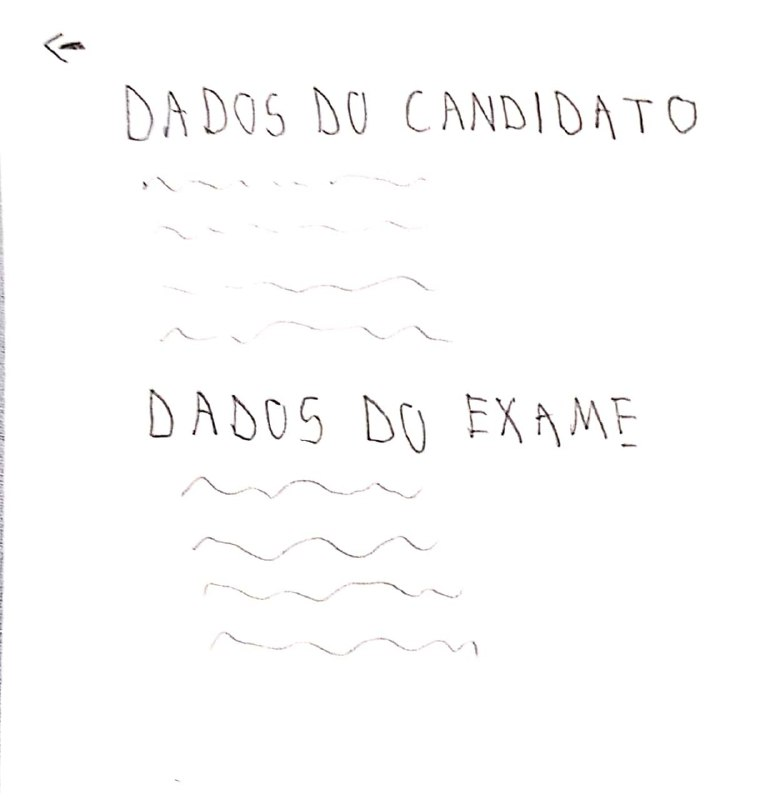
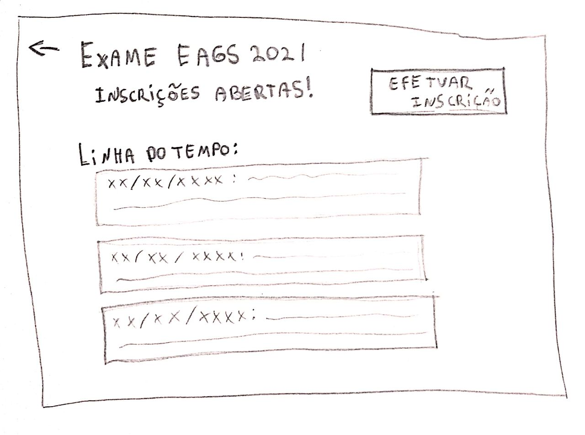
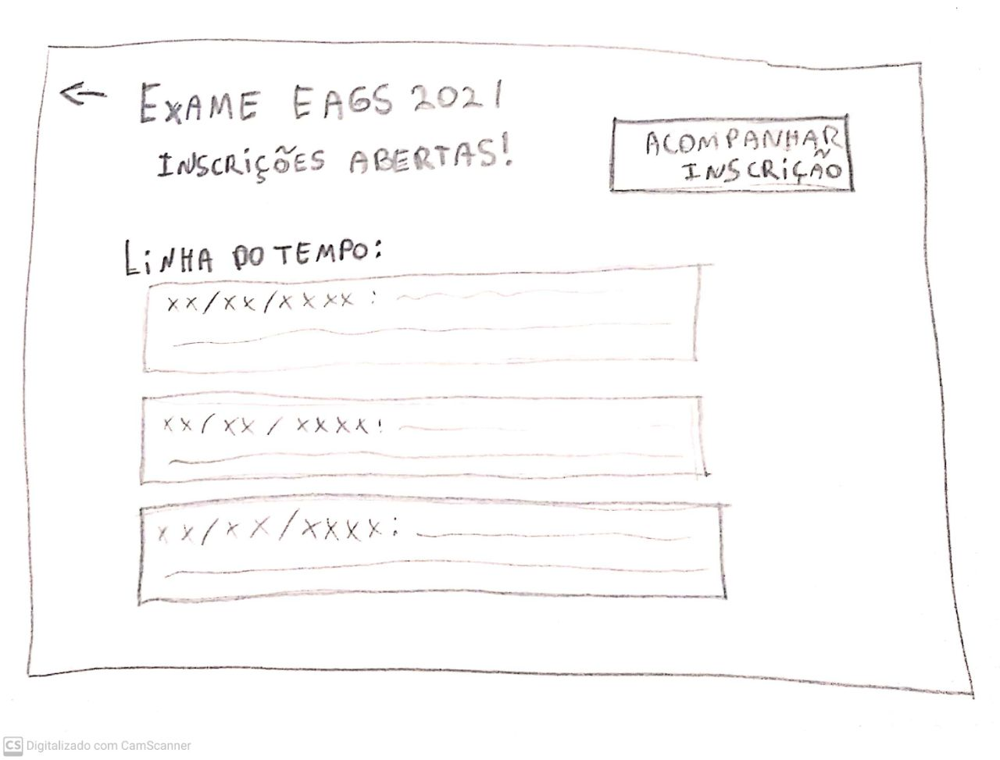
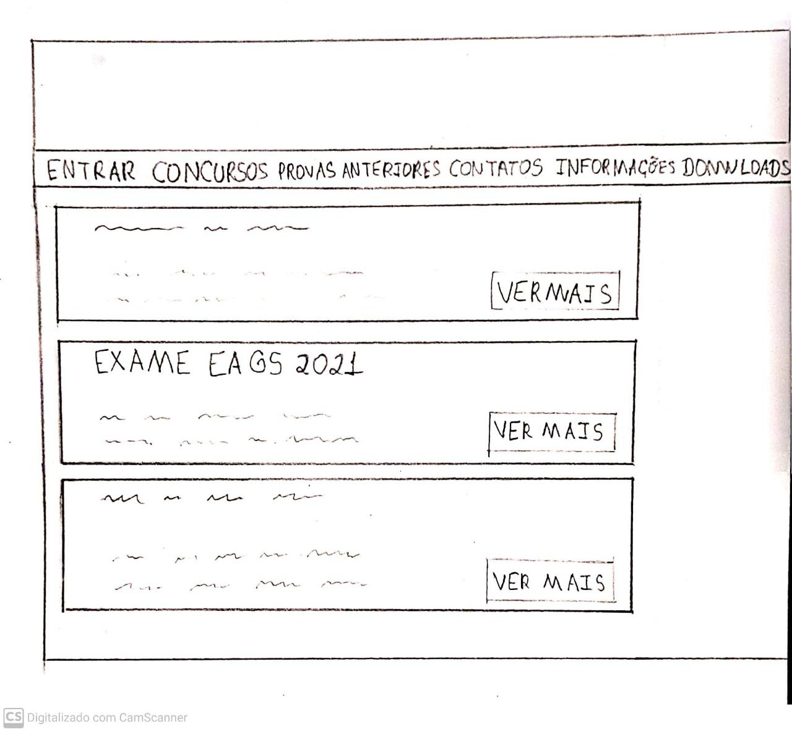
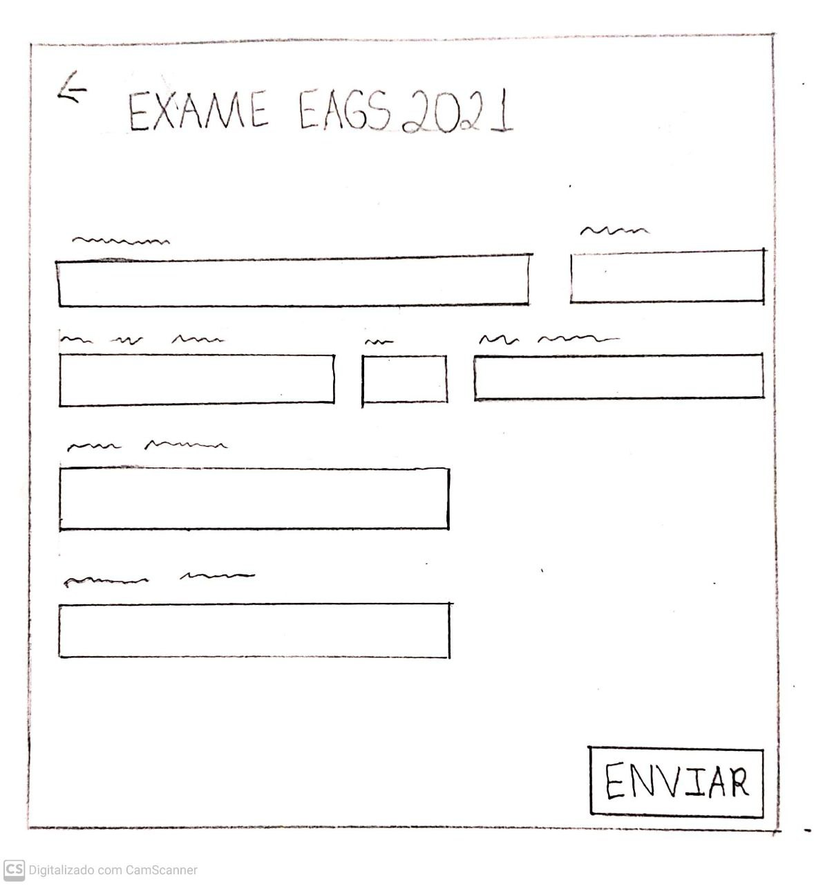
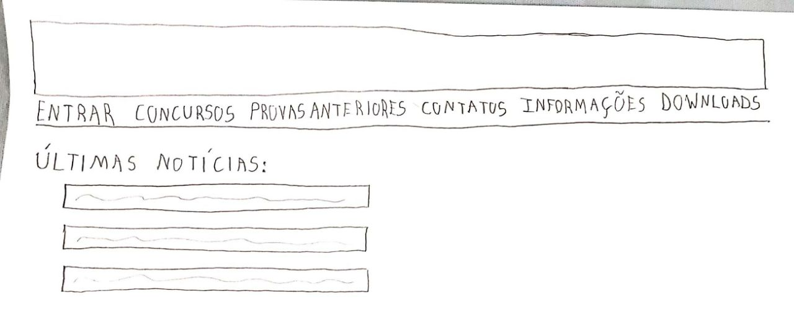
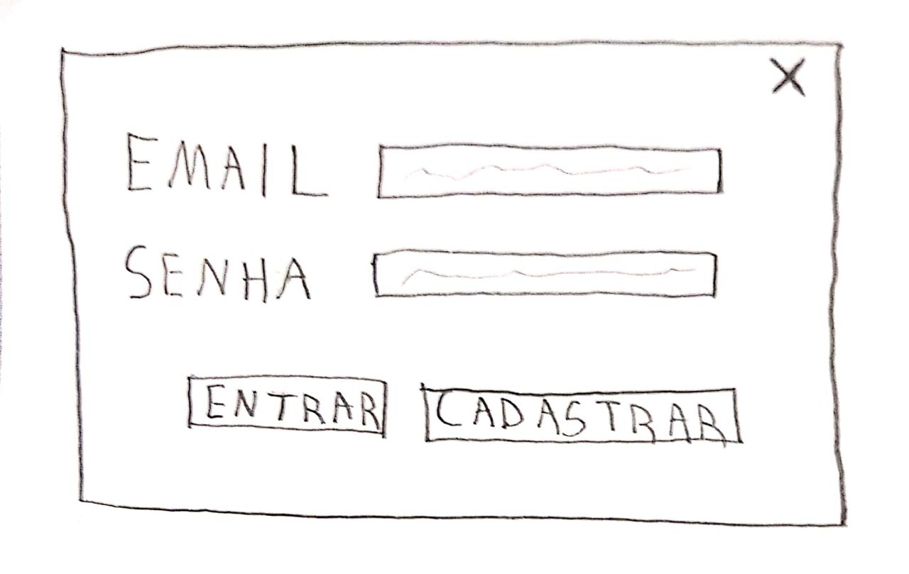
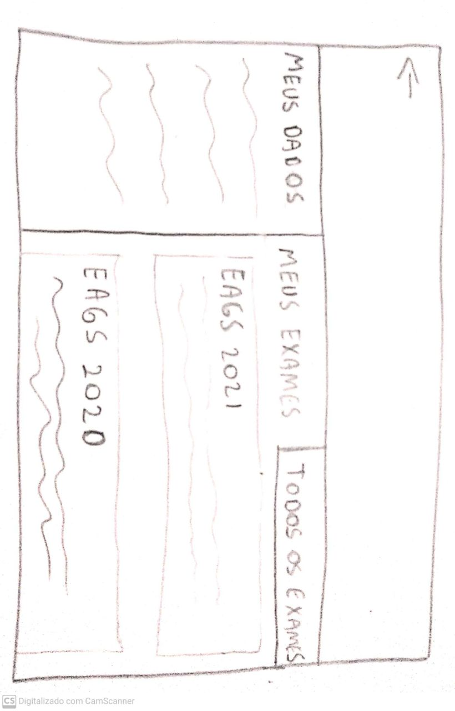
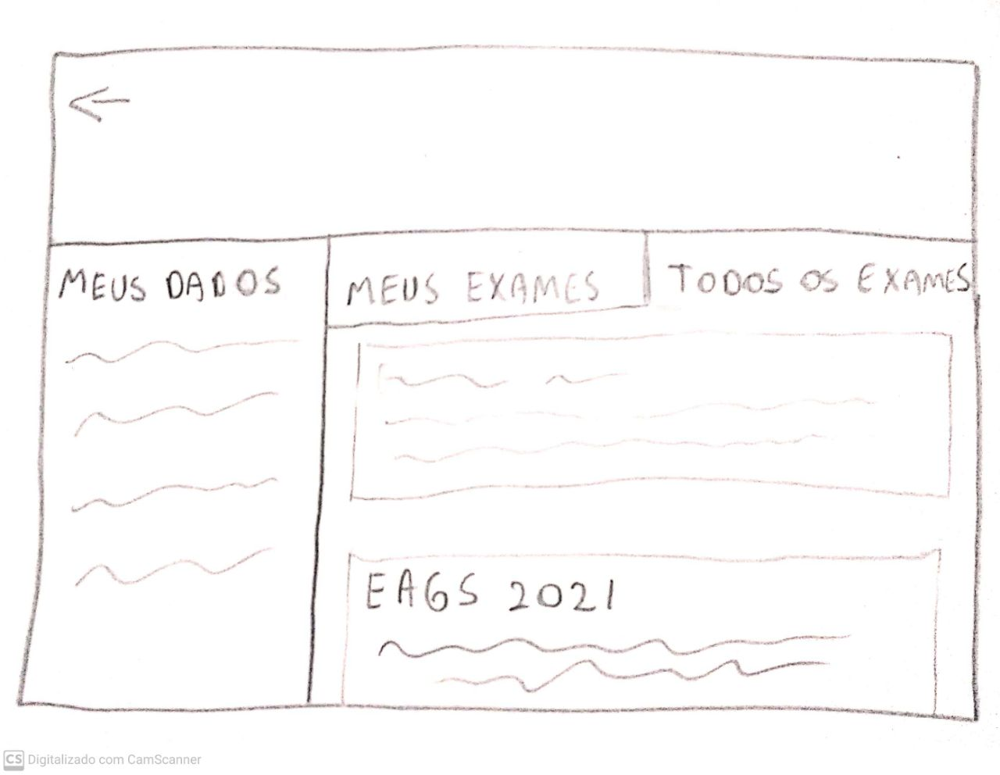

# Planejamento do protótipo de papel

## Introdução
&emsp;&emsp;É inegável que o uso de protótipos durante a atividade de design é de extrema importância para consolidação de ideias e correção das ideias do projeto. Dito isto, estaremos utilizando o método de Prototipação de Papel para a avaliação devido ao seu baixo custo e rapidez. O método de prototipação em papel avalia a usabilidade de um design de IHC representado em papel, através de simulações de uso com a participação de potenciais usuários. Abaixo, apresentamos o planejamento da avaliação que usará o protótipo de papel. 

## Metodologia
&emsp;&emsp;No nosso projeto, a metodologia a ser utilizada será a metodologia de avaliação para prototipação em papel, que foi extraída diretamente do livro de IHC de Simone Barbosa e Bruno Silva. Esse método consiste em 4 fases diferentes: Preparação, Coleta e Interpretação de Dados, Consolidação dos Resultados e Relato dos Resultados. Devido a situação atual da pandemia, a metodologia será aplicada à distância através de uma chamada online com compartilhamento de tela.  

| Atividade | Tarefas |
|--|--|
| Preparação | Definir tarefas para os participantes executarem; Definir o perfil dos participantes e recrutá-los; Criar protótipos em papel da interface para executar as tarefas; Executar um teste-piloto.|
| Coleta & Interpretação de Dados | Cada usuário deve executar as tarefas propostas interagindo com os protótipos, mediado pelo avaliador; O avaliador deve listar os problemas encontrados;  Refinar os protótipos para resolver os problemas mais simples |
| Consolidação dos Resultados | Priorizar a correção dos problemas não resolvidos Sugerir correções |
| Relato dos Resultados | Relatar os problemas encontrados e sugestões de correção |
 
## Termo de Consentimento
&emsp;&emsp;Visando uma maio lisura de todo o processo, os participantes convidados para a avalição terão que concorda com o seguinte termo:

&emsp;&emsp;Somos Estudantes de Engenharia de Software, da Universidade de Brasília, e estamos cursando a disciplina de Interação Humano-Computador, ministrada pelo professor Dr. André Barros de Sales. Estamos realizando um projeto que tem como objetivo identificar problemas na interface da plataforma Ingresso.EEAR e sugerir melhorias segundo às normas de IHC.  
&emsp;&emsp;O objetivo desta avaliação é analisar o fluxo de atividades apresentado no protótipo de papel desenvolvido pela equipe e fornecer possíveis sugestões de melhoria para o mesmo. Por isso, o presente termo visa solicitar o seu consentimento para a realziação dessa avaliação. Sendo assim, e para decidir sobre o seu consentimento, é importante que conheça as seguintes informações sobre a entrevista:

- Os dados coletados durante a entrevista destinam-se estritamente à atividades relacionadas à disciplina; 
- Nossa equipe tem o compromisso de divulgar os resultados de nossas pesquisas para os responsávei pela plataforma em estudo. A entrevista será gravada e divulgada na GitHub Pages do grupo. 
- O consentimento para a entrevista é uma escolha livre, feita mediante a prestação de todos os esclarecimentos necessários sobre a pesquisa. 
- A entrevista pode ser interrompida a qualquer momento, segundo a sua disponibilidade e vontade. 
- A entrevista terá duração entre 5 a 15 minutos.

De posse dessas informações, gostaríamos que você se pronunciasse acerca da entrevista:  

- Dou meu consentimento para a sua realização.  
- Não consinto com a sua realização.

## Preparação

### Tarefas
- [Efetuar a inscrição em concurso;](../../../analise-de-requisitos/analise-de-tarefas/#efetuar-a-inscricao-em-concurso)
- [Acompanhar inscriçao em concurso.](../../../analise-de-requisitos/analise-de-tarefas/#acompanhar-inscricao-em-concurso)

### Perfil dos Participantes
&emsp;&emsp;Serão convidadas pessoas que possuam um perfil semelhante ao das personas e usuários do Ingresso EEAR para serem entrevistados.

### Protótipos em Papel
&emsp;&emsp;Foram desenvolvidos em papel os prótotipos da plataforma sugerido pela equipe levando em consideração as tarefas a serem realizadas e todas as informações levantadas até então. Para realizar a interação do usuário com o protótipo, serár utilizada a plataforma **Marvel**.

[Link do protótipo na plataforma.](https://marvelapp.com/prototype/63d369a/screen/78909748)

Figura 1: Página de acompanhamento

Figura 2: Página do exame

Figura 3: Página do exame para usuário inscrito e logado

Figura 4: Exames Disponíveis

Figura 5: Formulário

Figura 6: Home

Figura 7: Login

Figura 8: Meus Exames

Figura 9: Todos os Exames

### Teste piloto
&emsp;&emsp;O presente teste piloto foi realizado com o intuito de identificar e corrigir potenciais erros no planejamento da avaliação.

[Teste Piloto](./teste-piloto-baixa.md)

## Coleta e Interpretação de Dados
&emsp;&emsp;A coleta de dados deve ser realizada por pelo menos dois avaliadores: um responsável por auxiliar o participante com a utilização da plataforma que simulará o sistema e outro por observar a experiência de uso. Como durante a simulação de uso existe pelo menos um avaliador responsável pela observação, ele pode começar a interpretar os dados da experiência de uso enquanto observa a atuação do usuário.  
&emsp;&emsp;Além disso foi elaborado o seguinte roteiro de perguntas que serão feitas no antes do início da interação e ao término da mesma para auxiliar o entrevistador na coleta e interpretação de dados:

| Número | Pergunta | Opções de resposta |
|:-:|:----------|-------------------|
| 1 | Em uma escala de 1 a 5, onde 1 equivale a muito inexperiente e 5 a muito experiente, qual é seu grau de experiência com a plataforma Ingresso EEAR? | 5 - Muito experiente  4 - Experiente 3 - Neutro  2 - Inexperiente 1 - Muito inexperiente  |
| 2 | Em uma escala de 1 a 5, onde 1 equivale a muito fácil e 5 a muito difícil, avalie o grau de dificuldade na execução das tarefas | 5 - Muito difícil  4 - Difícil 3 - Neutro  2 - Fácil 1 - Muito fácil   |
| 3 | Alguma sugestão de melhoria para a realização das tarefas? | Pergunta discursiva|

&emsp;&emsp;A pergunta número 1 deverá ser feita antes do inicio da interação e as demais após o término.
## Consolidação dos resultados
&emsp;&emsp;Aqui os avaliadores verificam quais problemas não puderam ser resolvidos no reprojeto rápido do protótipo de interface e sugerem propostas de correção desses problemas ou de caminhos que podem ser explorados para melhorar a interface. Além disso, o avaliador deve definir a hierarquia e severidade dos erros, para auxíliar na posterio correção.

## Relato dos Resultados
&emsp;&emsp;Nesta etapa os avaliadores devem documentar:

- Os objetivos da avaliação;
- Uma breve descrição do método de prototipação em papel;
- O número e o perfil de avaliadores e dos participantes;
- As tarefas executadas pelos participantes;
- Uma lista de problemas de usabilidade corrigidos durante os ciclos de avaliação e reprojeto, indiciando:
    - Local onde ocorreu;
    - Fatores de usabilidade prejudicados;
    - Descrição e justificativa do problema;
    - Correção realizada no protótipo de papel;
    - Indicação se o problema voltou a ocorrer depois da correção.
- Uma lista dos problemas de usabilidade ainda não corrigidos, indicando:
    - Local onde ocorreu;
    - Fatores de usabilidade prejudicados;
    - Descrição e justificativa do problema;
    - Prioridade para correção;
    - Sugestões de correção;
    - Indicações de partes do sistema que podem ser mais bem elaboradas.

## Bibliografia
> Barbosa, S. D. J.; Silva, B. S. da; Silveira, M. S.; Gasparini, I.; Darin, T.; Barbosa, G. D. J. (2021) *Interação Humano-Computador e Experiência do usuário.*
## Versionamento

|Versão|Data|Modificação|Autor|
|:-:|--|--|--|
|1.0|23/04/2021|Abertura do documento| Daniel B., Denys, Yan |
|1.1|23/04/2021|Modificação da introdução| Denys | 
|1.2|29/04/2021|Ajuste geral no documento| Daniel B. | 
|1.3|29/04/2021|Melhorias dos tópicos| Daniel P.|
|1.4|29/04/2021|Melhoria do termo de consentimento e ajustes após o teste piloto| Daniel P.|