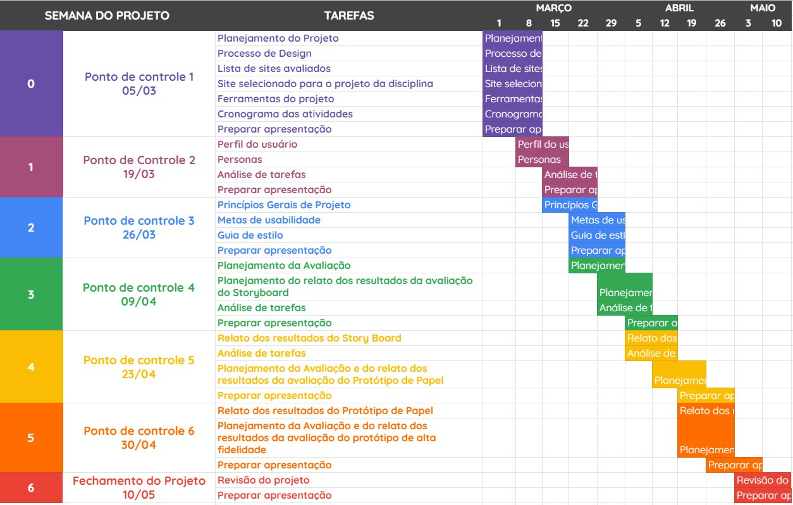
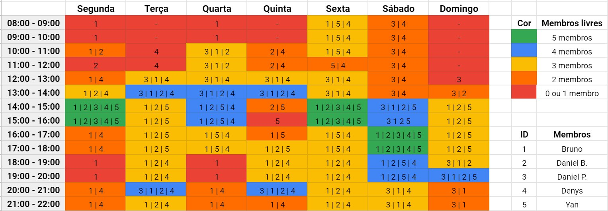

#Planejamento

## Introdução
&emsp;&emsp;Este documento aborda o Planejamento da equipe para o desenvolvimento das demandas ao longo do projeto. Estão incluidos aqui os site que a equipe avaliou para a escolha daquele que será trabalhado, o cronograma de atividades contendo as etapas e a integra do cronograma da equipe, a metodologia que será utilizada ao decorrer da disciplina, o processo de Design que será seguido e as ferramentas que serão utilizadas.

## Sites avaliados

- SIGAA - Daniel Barcelos e Bruno Felix;
- MPU - Daniel Porto;
- Ingresso.EEAR - Denys Rogeres;
- CAESB - Yan Andrade.

## Cronograma de Atividades

## Quadro de Disponibilidade

## Metodologia
### GitHub Kanbam:
&emsp;&emsp; É uma maneira de se aplicar o Kanbam utilizando as funcionalidades do GitHub. As atividades serão identificadas e especificadas por issues as quais terão os responsáveis e o registro do andamento. Também será feito o uso de labels para auxiliar na identificação das atividades.

### eXtreme Programming (XP):
&emsp;&emsp; Serão incorporados os valores de comunicação, simplicidade, feedback e coragem da metodologia eXtreme Programming.

### Política de branchs:
&emsp;&emsp; Para o desenvolvimento de artefatos e a realização de atividades em conjunto, será utilizada uma politica de branchs bem simples em que cada branch será criada com base em uma issue existente. As branchs serão nomeadas de acordo com os padrões "x_nome_da_issue" ou "x_nome_do_artefato", onde x é o número da issue. 
&emsp;&emsp; As branchs serão os espaços usados pelos responsáveis pela issue correspondente para a realização das atividades, que terão as atualizações registradas por commits. Ao final das atividades em uma branch, o conteúdo será adicionado a branch Main por meio de Pull Request.

### Política de commits:
&emsp;&emsp; A cada modificação significativa em artefatos do repositório ou quando o responsável achar cabível, será feito o commit das mudança. A mensagem do commit deve ser feita em Português utilizando o gerûndio explicando sucintamente as alterações feitas. O commit deve sempre apontar para o número da issue base da branch e para o de qualquer outra que se relacione com a alteração.

### Política de pull requests:
&emsp;&emsp; Cada artefato ou atividade será revisado por um ou mais integrantes da equipe alheios ao desenvolvimento do que será avaliado. Isso será feito por meio de Pull Requests.

### Reuniões de planejamento:
&emsp;&emsp; Inspiradas nos plannings da metodologia Scrum, serão feitas reuniões após as estregas para o planejamento das atividades referentes a entrega seguinte. Dentre outras coisas, serão discutidos e decididos nessas reuniões: os responsáveis por cada artefato e issue, os revisores de cada PR de artefatos e qualquer aspecto pertinente da disciplina.

## Processo de Design
&emsp;&emsp; A equipe optou por seguir o Processo de Design proposto por Deborah Mayhew (1999). 
&emsp;&emsp; O Cilco de Vida de Mayhew é composto por três fases iterativas: 
		
   - **Análise de Requisitos:** quando são definidas as metas de usabilidade baseando-se no perfil dos usuários, na anpalise das tarefas, nas possibilidades e limitações da plataforma de execução do sistema e nos princípios gerais de design de IHC;
   - **Design, Avaliação e Desenvolvimento:** quando se projeta, em três níveis de detalhes, as soluções de IHC tendo como objetivo conceber uma solução que atenda as metas de usabilidade estabelecidas anteriormente;
   - **Instalação:** quando o designer coleta opiniões dos usuários depois de algum tempo de uso para melhorar o sistema em versões futuras ou apontar necessidades de novos sistemas.

   
   
Figura 2: Ciclo de vida de Mayhew. Retirado de: BARBOSA, Simone. SILVA Bruno. "Interação Humano-Computador". Capítulo 4, página 110.

## Ferramentas

Ferramenta | Nome | Descrição 
 :--: | :--: | :--: 
 | Google Drive | Plataforma utilizada para armazenar os slides da apresentação e outros artefatos gerados.
 | Planilhas Google | Ferramenta para criação de planilhas.
 | Telegram | Ferramenta de comunicação rápida entre os integrantes.
 | Figma | Ferramenta utilizada para a elaboração de protótipos de design.
 | Apresentações Google | Ferramenta utilizada para criação de slides simultaneamente entre os integrantes.
 | GitHub | Plataforma de versionamento em que iremos armazenar todos os artefatos relacionados ao projeto.
 | MKdocs | Plataforma utilizada para gerar um site estático na web.
 | StreamYard | Plataforma utilizada para gravação das apresentações do projeto.
 | Discord | Plataforma utilizada para reunião com os integrantes do projeto.

## Bibliografia
> BARBOSA, Simone. SILVA Bruno. "Interação Humano-Computador",

## Versionamento
| Versão | Data | Modificação | Autor |
|--|--|--|--|
| 1.0 | 27/02/2021 | Criação do documento | Daniel Porto |
| 1.1 | 27/02/2021 | Adição da introdução, dos sites avaliados, da metodologia e do processo de design | Daniel Porto |
| 1.2 | 28/02/2021 | Correção do tópico dos sites avaliados | Daniel Porto |
| 1.3 | 02/03/2021 | Adição das ferramentas utilizadas | Yan Andrade |
| 1.4 | 05/03/2021 | Adição do versionamento do cronograma | Daniel Barcelos |
| 1.5 | 05/03/2021 | Adição do versionamento do cronograma | Denys Rógeres |
